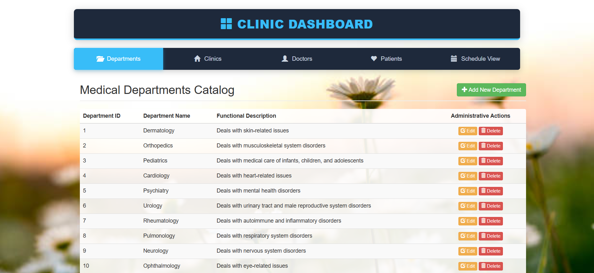

# Clinic Management System

An academic database-driven web application designed to optimize clinic workflows, manage medical departments, and track patient records. The system features a robust MySQL relational database backend architecture paired with a responsive web interface built using Python, Flask, and Bootstrap.

---

## 1. Project Overview

The **Clinic Management System** provides administrative automation for clinical operations. The primary objective is to streamline and optimize the relational tracking between core clinic entities: medical departments, individual clinics, specialized doctors, patients, and scheduled appointments. 

### Key Features Implemented:
* **Relational Database Design:** Normalized database schema safeguarding cross-table integrity with strict Primary Key and Foreign Key constraints.
* **Full CRUD Operations Suite:** Expanded interface allowing administrators to Create, Read, Update, and Delete records dynamically across **Departments, Clinics, Doctors, and Patients** without raw SQL intervention.
* **Automated Scheduling Logic Safeguards:** Advanced procedural database triggers that dynamically audit time blocks to prevent concurrent, overlapping appointments for any single physician.
* **Balanced Full-Width Dashboard UI:** A dark slate structural navigation bar featuring responsive flexbox distribution to ensure seamless touch and click tracking layout access.

---

## 2. Repository Structure

The project directory is meticulously structured to ensure a clean separation of concerns between database configuration scripts and application engine source code layers:

```text
├── /README.md                 # Project documentation and execution instructions
├── /report.docx               # Final comprehensive design report 
├── /presentation.pptx         # Presentation slide deck for project walkthrough
├── /video_link.txt            # Publicly accessible video presentation URL
├── /Questions answer.pdf      # answer of questions at the project

│
├── /sql/                      # Relational database layer
│   ├── create_tables.sql      # DDL: Schema creation, constraints, and operational views
│   ├── load_data.sql          # DML: Seed datasets providing >10 rows per core table
│   ├── queries.sql            # Query scripts: Selection, complex join, and analytical filters
│   └── triggers.sql           # Procedural scripts: Automated schedule validation checks
│
└── /src/                      # Application source code layer
    ├── Project.py             # Main Python Flask server script and routing orchestrator
    ├── templates/             # UI presentation layer (Jinja2 Templates)
    │   ├── header.html        # Shared layout header, customized navigation flex ribbon
    │   ├── index2.html        # Primary departments panel dashboard view & CRUD modals
    │   ├── clinics.html       # Clinic rooms lookup data grid with relational dropdown fields
    │   ├── doctors.html       # Physician registry dashboard with assignment capabilities
    │   └── patients.html      # Patient master index profile tracking and registration records
    │   └── appointments.html  # to show the view that i create
    └── static/                # Asset management framework files
        ├── css/
        │   ├── bootstrap.css
        │   ├── bootstrap.min.css
        │   └── bootstrap-theme.css
        └── js/
            ├── bootstrap.js
            ├── bootstrap.min.js
            ├── jquery-3.2.1.min.js
            └── npm.js
            
```
### 💻 Technical Stack
Backend Environment: Python 3.8+ / Flask Microframework

Database Driver System: MySQL / flask_mysqldb connection wrapper

Frontend UI Engine: HTML5 / Jinja2 Template Language / CSS3

UI Layout Framework: Bootstrap v3.3.7 / jQuery v3.2.1

## 3. How to Load the Database and Run the Code
Follow these setup steps sequentially to build the database schema, populate the tables, install dependencies, and run the system locally:

### Step 1: Initialize and Load the Database (MySQL)
Launch your local MySQL database engine server (via XAMPP Control Panel, WampServer, or a native command-line installation).

Open your preferred database management interface (such as phpMyAdmin, MySQL Workbench, or your command-line shell console).

Open and run the script located at /sql/create_tables.sql. This generates the default container schema ClinicManagementSystem along with all 5 core table structures, structural keys, and reporting views.

Populate your database tables by executing the script at /sql/load_data.sql. This inserts over 10 fully complete, valid records per lookup table.

Apply advanced automated functional business rules by running the file at /sql/triggers.sql.

### Step 2: Python Environment Dependency Setup
Ensure Python is fully installed on your host machine. Open your system terminal or command prompt inside the project's root /src/ directory and run the following command to install the required libraries:

Bash
pip install flask
pip install flask_mysqldb
(Note for Windows Users: If compiling flask_mysqldb encounters errors, make sure a C++ compiler build tool is installed on your operating system, or use pre-compiled binaries instead).

### Step 3: Verify Database Connection Credentials
Open the primary python server routing file (/src/The Project.py) and confirm that the configuration host attributes align perfectly with your local running MySQL database server instance:

Python
app.config['MYSQL_HOST'] = 'localhost'
app.config['MYSQL_USER'] = 'root'       # Change to your specific MySQL account username
app.config['MYSQL_PASSWORD'] = ''       # Insert your MySQL server access password if set
app.config['MYSQL_DB'] = 'ClinicManagementSystem'
Step 4: Run the Web UI Application
Execute the core Python server orchestrator script from your runtime environment terminal shell:

Bash
python "The Project.py"
The terminal console will initialize a local host processing worker thread. Open your web browser and navigate directly to:

Plaintext
[http://127.0.0.1:5000/]

### Key Features Implemented:
* **Relational Database Design:** Normalized database schema safeguarding cross-table integrity with strict Primary Key and Foreign Key constraints.
* **Full CRUD Operations Suite:** Expanded interface allowing administrators to Create, Read, Update, and Delete records dynamically across **Departments, Clinics, Doctors, and Patients** without raw SQL intervention.
* **Automated Scheduling Logic Safeguards:** Advanced procedural database triggers that dynamically audit time blocks to prevent concurrent, overlapping appointments for any single physician.
* **Balanced Full-Width Dashboard UI:** A dark slate structural navigation bar featuring responsive flexbox distribution to ensure seamless touch and click tracking layout access.

### 🖥️ Interface Preview
